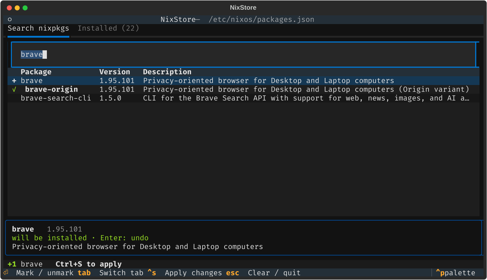

<p align="center">
  
</p>

# NixStore

A terminal app store for NixOS. Search nixpkgs, mark packages to install or
remove, and apply everything with one `nixos-rebuild switch`, without editing
Nix files by hand.



- **Live search** across your flake's pinned nixpkgs: exact names first, then
  prefixes, then substrings (`brave` → `brave`, `brave-origin`, `brave-search-cli`)
- **Queue changes** from the *Search* and *Installed* tabs, apply them together
- **Safe rebuilds**: if `nixos-rebuild` fails, your package list is restored
- **CLI** for scripts: `nixstore install btop`, `nixstore remove btop`, …
- Desktop entry with icon, so it shows up in rofi, fuzzel, GNOME, KDE, …

## How it works

Your installed packages live in a plain JSON list inside your system flake:

```json
[
  "brave-origin",
  "git",
  "kdePackages.dolphin"
]
```

The NixOS module adds every entry to `environment.systemPackages`. NixStore edits
that file (via `sudo`) and runs `nixos-rebuild switch --flake <your flake>`.
Everything else in your configuration stays yours.

## Install

Add the flake to your system flake:

```nix
{
  inputs.nixstore = {
    url = "github:ExpressoCodes/nixstore";
    inputs.nixpkgs.follows = "nixpkgs";
  };

  outputs = { nixpkgs, nixstore, ... }: {
    nixosConfigurations.myhost = nixpkgs.lib.nixosSystem {
      modules = [
        ./configuration.nix
        nixstore.nixosModules.default
      ];
    };
  };
}
```

Enable it in `configuration.nix` and create the package list next to your
`flake.nix` (`echo '[]' | sudo tee /etc/nixos/packages.json`):

```nix
{ pkgs, ... }:
{
  programs.nixstore = {
    enable = true;
    packagesFile = ./packages.json;
    # Optional: open in a specific terminal instead of the desktop default.
    terminalCommand = "${pkgs.kitty}/bin/kitty --class nixstore --title NixStore";
  };
}
```

You can move packages from `environment.systemPackages` into `packages.json`
to manage them with NixStore.

### Options

| Option | Default | Description |
| --- | --- | --- |
| `programs.nixstore.enable` | `false` | Install NixStore |
| `programs.nixstore.packagesFile` | `null` | JSON package list added to `environment.systemPackages` |
| `programs.nixstore.flake` | `"/etc/nixos"` | System flake directory to edit and rebuild |
| `programs.nixstore.packagesFilePath` | `"<flake>/packages.json"` | Where `packagesFile` is on disk |
| `programs.nixstore.terminalCommand` | `null` | Terminal command for the desktop entry (`null` = `Terminal=true`) |
| `programs.nixstore.package` | this flake | Package to use |

Without the module: `nix run github:ExpressoCodes/nixstore`, or use
`overlays.default` to get `pkgs.nixstore`. Set `NIXSTORE_FLAKE` and
`NIXSTORE_PACKAGES_FILE` to point it at your files.

## Usage

Launch **NixStore** from your app launcher, or run `nixstore`
(`nixstore tui btop` opens it with a search).

| Key | Action |
| --- | --- |
| type | Search (Search tab) or filter (Installed tab) |
| `↑` `↓` `PgUp` `PgDn` | Move through results |
| `Enter` / click | Mark for install `+` / removal `−`, again to undo |
| `Tab` | Switch between *Search nixpkgs* and *Installed* |
| `Ctrl+S` | Review changes, enter sudo password, rebuild |
| `Esc` | Clear the search box, then quit |

Markers: `✓` installed · `+` will be installed · `−` will be removed ·
`•` installed by another `.nix` file (edit that file to remove it).

### CLI

```sh
nixstore search spotify        # search nixpkgs
nixstore install btop spotify  # add packages and rebuild
nixstore remove spotify        # remove packages and rebuild
nixstore list                  # packages in packages.json
```

## Notes

- The first search after a nixpkgs update builds a package index
  (`nix search`, ~30s). It is cached in `~/.cache/nixstore/`.
- Library sets (`python3Packages`, `haskellPackages`, …) are left out of search.
- Removing a package does not free disk space until you run
  `sudo nix-collect-garbage -d`.

## Development

```sh
nix develop
pytest
python -m nixstore --flake /etc/nixos
```

## License

MIT
